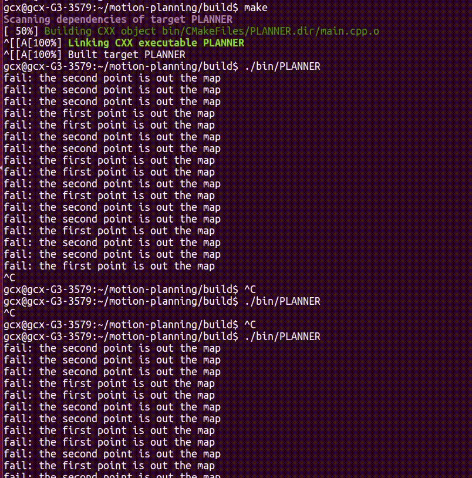

# motion-planning

## Statement
I am learning motion-planning algorithms, so I plan to implement some classical ones in C++, which may make me understand them much deeplier.

By the way, this is my first public repo!

## demos
### 1.RRT
　

### 2.Dijkstra



### 3.A*


## dependence
### 1.cmake
### 2.opencv 4
* [how to configurate opencv 4.5.2 in Linux](https://github.com/goxixi/motion-planning/wiki#how-to-configurate-opencv)
### 3.eigen3

## make
### Linux
```
mkdir build
cd build
cmake ..
make
```
## run
```
./bin/PLANNER
```
ps: please run the programme at the folder `"motion-planning/build"` of run it at `"motion-planning/build/bin"` with `./PLANNER`      

input `ctrl+c` to exit
